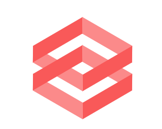

    

<h1 align="center"><b> TEAM CODEOVERFLOW INITIATIVE </b></h1>

    

    
   

        
    
  
  

## Overview

## Installation

## Community and Contributions
When contributing to this repository, please first discuss the change you wish to make via issue, email, or any other method with the owners of this repository before making a change. Please note we have a code of conduct, follow it in all your interactions with the project.

## Found a bug? Missing a specific feature?

Feel free to **file a new issue** with a respective title and description on the repository. If you already found a solution to your problem, **we would love to review your pull request**!

## License
The Project is released under the terms of the [MIT License](LICENSE).

 
 

    

 

<table>
  <tr>
       <td align="center"><a href="https://github.com/AnanyaNegi"> <b>ANANYA NEGI</b></a> 

    
   
    
    
  

</td>
      
   <td align="center"><a href="https://github.com/yadvi12"> <b>YADVI BHALLA</b></a> 
    

   
   
    
    
  

</td>
   
   <td align="center"><a href="https://github.com/Reeti1605"> <b>REETI JHA</b></a> 

    
   
    
    
  

</td>
   
   <td align="center"><a href="https://github.com/ampsteric"> <b>SHASHWAT MISHRA</b></a> 

   
   
    
    
  

</td>
    </tr>
    </table>
